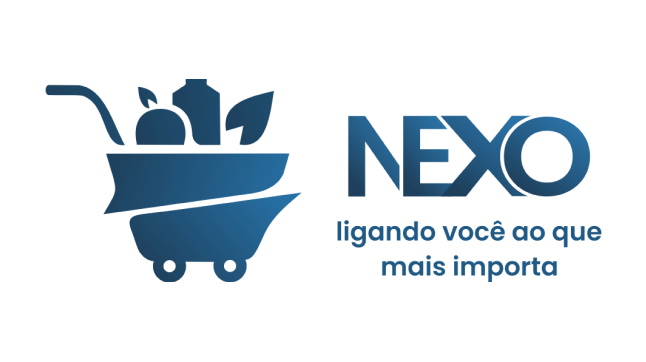

# 🛒 Minimercado NEXO

 

 

    

## O que é o NEXO?
O **NEXO** é um minimercado local fictício. O projeto foi criado com a visão de oferecer soluções tecnológicas eficientes e de fácil manutenção, destinadas a gerenciar as operações de um mercadinho tradicional. Inspirado pela simplicidade e pela conexão direta com a comunidade, o nome "NEXO" reflete o papel do mercado em unir clientes e fornecedores, criando um ponto de encontro entre necessidades e soluções.

## 🖥️ Sistema de Gerenciamento Geral (Desktop)

A versão desktop visa centralizar a administração do minimercado, focando na realização de operações cotidianas, como:

- [x] **Controle de Estoque:** Atualizar e monitorar o inventário em tempo real, incluindo notificações para níveis baixos de estoque.
- [x] **Gerenciamento de Clientes:** Funções dedicadas ao cadastro e manutenção dos dados dos clientes do programa de fidelidade.
- [x] **Relatórios Gerenciais:** Geração de relatórios personalizados com JasperReports para análises de vendas e estoque, com integração ao MySQL para persistência de dados.
- [x] **Controle de Compras:** Gestão de compras e impressão de comprovantes e relatórios de fluxo de caixa
- [x] **Gerenciamento de Funcionários:** Cadastro e manutenção dos dados dos funcionários do minimercado

> Para uso da aplicação e informações de funcionamento, navegue até a branch [desktop_app](https://github.com/ferreiraluizga/nexo/tree/desktop_app)

## 🌐 Sistema de Gerenciamento de Estoque (Web)

A versão desktop visa proporcionar rapidez e facilidade no gerenciamento do estoque, possuindo os seguintes atributos:

- [x] **Painel Responsivo de Estoque:** Visualização em tempo real dos produtos em estoque e seus status.
- [x] **Histórico de Movimentação:** Relatórios de entradas e saídas de estoque.
- [x] **Interface de Usuário Simplificada:** Layout responsivo e moderno com Bootstrap, garantindo uma experiência fluida e intuitiva.

## 📱 NEXOClub (Mobile)

O **NEXOClub** é o aplicativo mobile do programa de fidelidade, projetado para proporcionar uma experiência direta e personalizada aos clientes:

- [x] **Benefícios e Ofertas:** Ofertas exclusivas e benefícios nas compras no minimercado NEXO.
- [x] **Interface Moderna e Intuitiva:** interface moderna, navegação simplificada e responsiva em diferentes dispositivos.